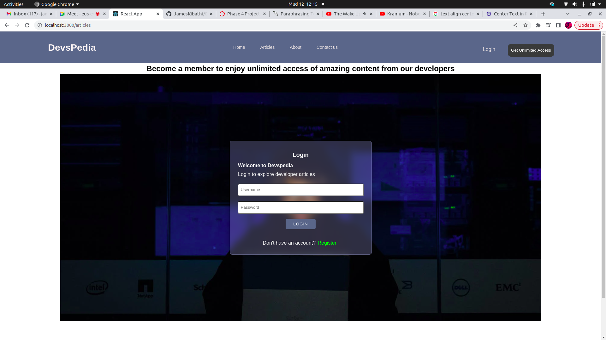

# Devspedia Web Application

This is the Frontend of a group project created in November 2022 at the end of phase 4 of our Software Engineering Bootcamp at Moringa School.

## Contributors

Gibson Bett

James Njenga

Ronny Bett

Maureen Kamau

Kibet Immanuel

# Introduction

- During our time at Moringa, we saw that junior devs need a platform for documenting their progress as they learn software engineering. For juniors who are just starting out, the already existing sites, like Medium, can be intimidating.

# Description

- We developed a website application that offers students a place to publish articles and track their experience. This will allow us to establish an even wider community because any internet user will be able to subscribe to access more content.

# Technologies and Tools Used

* HTML - to structure our forms
* CSS, Material UI, React Icons - For styling pages
* ReactJS- Client side rendering and routing
* Ruby on Rails - developing the backend API 
* PostgreSQL - storing database tables
* Railway - Hosting the API
* Netlify - Hosting the Frontend

# MVPs

A user can:

* view free articles

* Become a member to gain access to premium content

* Be able to log in and out of their account

A Dev can:

* Sign up for an account

* Be able to update profile

* Be able to create new article and delete an existing article

* Only have access to their articles

# Link to the repository

- https://github.com/iamkibeh/devspedia-frontend
- https://github.com/JamesKibathi/Devspedia-Backend

# Setup / Installation Requirements

* Backend server : https://Devspedia-API-production.up.railway.app
* Web Browser
* Internet connection

### Installation steps

* This App is live, but you can also run it locally; here is the live link: https://netlify

* To run locally, fork and clone the repository to your local machine, then run `npm install` to add dependencies.

* Fork and clone the backend API (https://github.com/JamesKibathi/Devspedia-Backend) and follow the installation steps as outlined on the README of the repo.

* Run and start the server.

* Upon successfully starting the server, Run `npm start` and the app will launch on the browser.

### How it works

After a successful launch, the user is redirected to a home page

From the homepage, a new user will just have access to the free articles 

If a user, wants to access all articles, they will be prompted to signup

If you don't have an account already, you will be allowed to create one
by clicking on the link: `Don't have an account? Register`

Upon a successful Login, You will be redirected to your account where you will have access to all articles.

#### Dev Logins
You can also log in as a dev to be able create and delete articles:

dev route : https://Devspedia-API-production.up.railway.app/dev

a dev will be promted to login 

if they don't have an account, they will be able to signup:

Upon a successful login, a dev will be redirected to a dashboard where they can be able to 
create profile, create article, delete article, view all their articles

## Known Bugs

Article card not properly styled. There's still room for improvement.

## Support and contact details

njenga.consulting@gmail.com

gibson.bett@student.moringaschool.com

mkaymaureen@gmail.com

ronny.bett@student.moringaschool.com

kibet.immanuel@student.moringaschool.com

# License

MIT License

Copyright (c) 2022 Gibson Bett, Ronny Bett, Kibet Immanuel, Maureen kamau and James Njenga.
Permission is hereby granted, free of charge, to any person obtaining a copy
of this software and associated documentation files (the "Software"), to deal
in the Software without restriction, including without limitation the rights
to use, copy, modify, merge, publish, distribute, sublicense, and/or sell
copies of the Software, and to permit persons to whom the Software is
furnished to do so, subject to the following conditions:
The above copyright notice and this permission notice shall be included in all
copies or substantial portions of the Software.